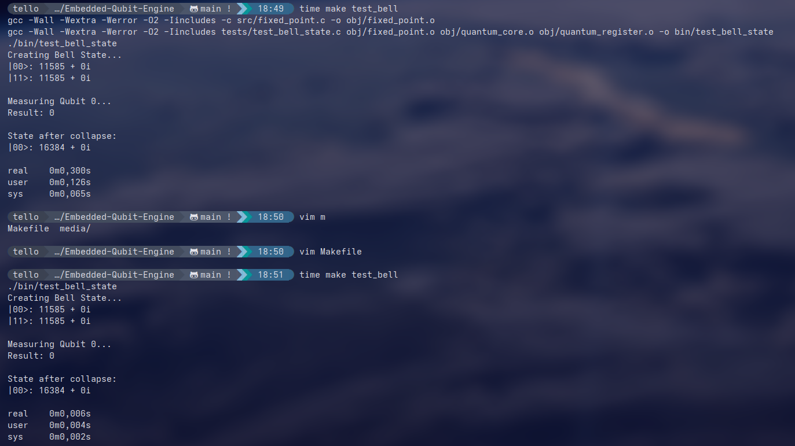

# Embedded Qubit Engine Sim
**6-Qubit Quantum Simulation on 8-bit AVR Architecture (Q1.14 Fixed-Point)**

Specialized quantum state-vector simulator designed to run core quantum algorithms on an ATmega328P (Arduino Uno). By tweaking standard floating-point libraries and implementing custom inline AVR Assembly, this engine archieves high-fidelity operations in a highly resource-constrained environment.

---

## Project Milestones

1. **The Core Math** – Developed a custom complex number library using fixed-point arithmetic to avoid the 8-bit FPU bottleneck in the ATmega.
2. **Hardware Entropy** – Integrated an ADC-based entropy harvester (analogRead(A0)) to seed the quantum RNG with real-world atmospheric noise (in the desktop version is a fixed value).
3. **AVR-ASM Optimization** – Replaced C math bottlenecks with Inline Assembly for gate applications, reducing latency to microsecond scales.
4. **Scaling to 6-Qubits** – Storing 64 complex amplitudes ($2^6$ states, arduino only has 2KB SRAM so $2^8$ states is the limit).
5. **Grover’s Algorithm** – Successfully implemented Amplitude Amplification, achieving 99.33% Fidelity across a 162-gate circuit.

---

## Performance Benchmarks (6-Qubit Search)
Measurements taken on ATmega328P @ 16MHz using Pure Compute Timing (excluding Serial overhead and delays).

| Metric | Result |
| :--- | :--- |
| **Total Gates Executed** | 162 Gates |
| **Pure Compute Time** | 28.40 ms |
| **Avg Latency per Gate** | 175.30 us |
| **Algorithm Fidelity** | 99.33% |
| **Memory Footprint** | 456 / 2048 Bytes (22%) |
| **System Status** | **OPTIMAL / STABLE** |
---

**We could use more qubits but then you have an output of hundreds of lines**

---

## Technical Architecture

### 1. Fixed-Point Math (Q1.14)
To maintain speed without losing the phase information required for quantum interference, the engine uses a 16-bit signed integer format:
* **Format**: 1 sign bit + 1 integer bit + 14 fractional bits.
* **Precision**: $\approx 0.000061$ per amplitude.
* **Rounding**: Uses a $2^{13}$ bias addition to minimize cumulative error in deep circuits.

### 2. AVR-ASM Optimization
Standard C multiplication on AVR takes approximately 80 cycles. This project includes hand-optimized Assembly blocks for complex multiplication:
* Utilizes `muls`, `mul`, and `mulsu` instructions for partial products.
* Replaces 14 slow shifts with register swaps and 2 shifts, making division by $2^{14}$ nearly instantaneous.

#### Test image (first Q1.14 and then AVR-ASM):


---

## Build System and Portability

The project features a dual-build system allowing for cross-platform development and bare-metal deployment.

### 1. Desktop Mode (Root Makefile)
The root directory contains a Makefile for desktop environments (Only tested in Linux but should work anywhere). This build uses a C fallback for the assembly routines (not supported in desktop CPUs), allowing for rapid testing, unit verification, and high-speed simulations.
* **Use case**: Running the extensive test suite in the `tests/` directory.
* **Command**: `make test_grover` or `make test_bell`.

### 2. Arduino Mode (QuantumCore Makefile)
Inside the `QuantumCore/` directory, a second Makefile manages the deployment to AVR hardware via `arduino-cli`. This version enables the inline assembly optimizations and hardware-specific features like ADC noise harvesting.
* **Use case**: Deploying to an actual Arduino Uno for hardware verification.
* **Command**: `cd QuantumCore && make compile && make upload && make monitor`.

---

## Repository Structure

```text
.
├── includes/              # Header files for desktop/C builds
├── media/                 # Execution traces and performance screenshots
├── QuantumCore/           # Arduino-specific project directory
│   ├── src/               # Optimized source with AVR Assembly
│   ├── Makefile           # Build system for arduino-cli
│   └── QuantumCore.ino    # Main firmware entry point
├── src/                   # C implementation for desktop builds
├── tests/                 # Comprehensive test suite (Bell, Teleport, Grover)
├── LICENSE
└── Makefile               # Root Makefile for desktop simulation
```

---

## Final Execution Report
```text
=========================================
       RAW PERFORMANCE REPORT            
=========================================
Total Gates Executed:  162
Pure Compute Time:     28.42 ms
Avg Time Per Gate:     175.43 us
Algorithm Fidelity:    99.33%
Memory Usage (SRAM):   456 / 2048 bytes
System Status:         [OPTIMAL]
=========================================
```

## Test video(arduino)

https://github.com/user-attachments/assets/535a957f-b07c-45db-b69a-29ea07d3a96a


## Other tests

```bash
# Build & run Bell state (entanglement) test
make test_bell
```


```bash
# Grover search with probability visualization
make test_grover n=7
```

