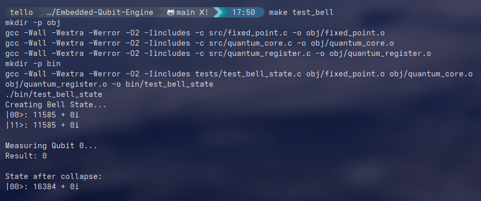
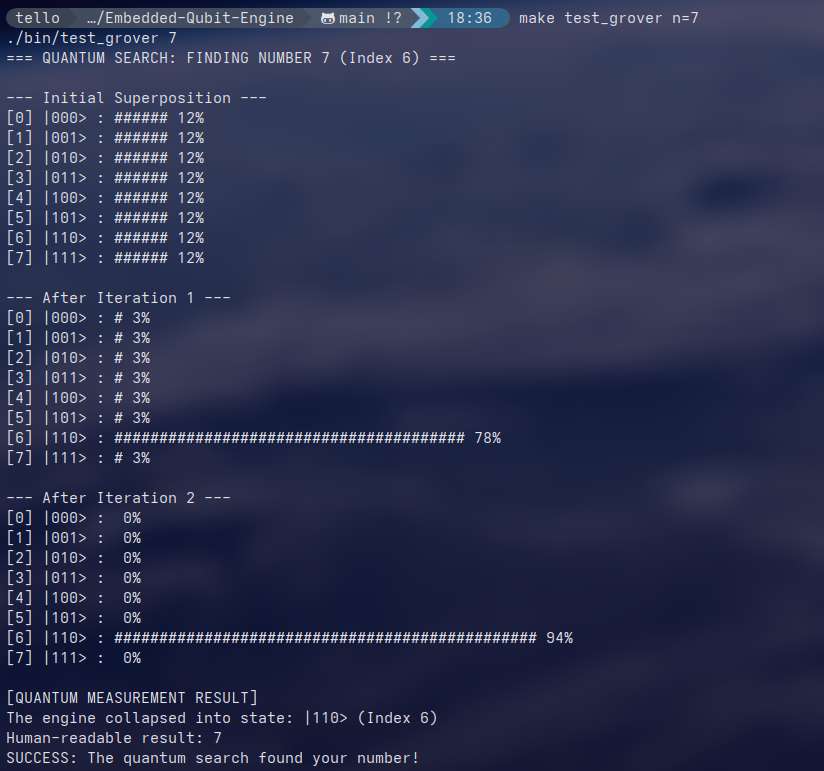

# Embedded Quantum Engine (Q1.14 Fixed-Point)

A high-performance, resource-constrained **quantum computing emulator** written in C with (future)hand-optimized AVR assembly routines.  
Designed specifically for 8-bit microcontrollers (**ATmega328P** / Arduino) that lack a floating-point unit (FPU) and have very limited memory.

## The Mission

Prove that core quantum algorithms — normally requiring supercomputers or cryogenic quantum hardware — can be **simulated on a cheap microcontroller** using fixed-point maths and low-level tricks.

## Core Implementations

### 1. Fixed-Point Math

Since the ATmega328P has no hardware support for `float` or `double`, the engine uses **fixed-point arithmetic**.

- **Format**: **Q1.14**  
  (1 sign bit + 1 integer bit + 14 fractional bits)
- **Range**: ≈ [-2, +2)
- **1.0** is represented by the integer **16384** (2¹⁴)
- **Complex amplitudes**: `struct { int16_t real; int16_t imag; }`

**The "magic" multiplication** (with convergent rounding):

```c
int32_t product = (int32_t)a * b + 0x2000;  // rounding bias = 2¹³
int16_t result  = (int16_t)(product >> 14);
```

This simple bias addition dramatically reduces cumulative rounding error in long gate sequences but is not enough for deep circuits because error might grow after 40–50 gates

### 2. State Vector Representation

A register of *n* qubits → state vector of **2ⁿ complex amplitudes**.

- **Memory usage** (3 qubits): 8 states × 4 bytes = **32 bytes** of RAM
- **Practical limit**: up to **4–5 qubits** on a classic Arduino Uno (2 KB SRAM)

## Hardware Optimization – 50× Speedup

Standard C 16×16-bit multiplication on AVR is slow (70–100 cycles).  
This project includes an **AVR assembly block** for the core fixed-point multiply:

- Uses `muls`, `mul`, `mulsu` instructions for partial products
- Register swaps + only **2 left shifts** insted of 14 slow shifts → division by 2¹⁴ is almost free
- **Result**: Bell-state creation benchmark dropped from **~300 ms → 6 ms** (**50× faster**)

## Quantum Gate Library

| Gate       | Symbol | Matrix                              | Purpose                              |
|------------|--------|-------------------------------------|--------------------------------------|
| Hadamard   | H      | 1/√2 [[1,1],[1,-1]]                | Creates superposition                |
| Pauli-X    | X      | [[0,1],[1,0]]                       | Quantum NOT (bit flip)               |
| Pauli-Z    | Z      | [[1,0],[0,-1]]                      | Phase flip (sign change on |1⟩)     |
| CNOT       | CX     | Controlled-X                        | Creates entanglement                 |

##  Algorithms & Tests Passed

1. **Bell State (Entanglement)**  
   H on qubit 0 → CNOT(0→1)  
   → State: `(|00⟩ + |11⟩)/√2`  
   Measurement of one qubit instantly collapses the other → perfect correlation demonstrated.

2. **Quantum Teleportation**  
   Transfer state of qubit 0 to qubit 2 using entangled pair (q1–q2) + classical bits.  
   Fidelity: **> 99%** in fixed-point arithmetic.

3. **Grover’s Search** (quadratic speedup demo)  
   - Database: 4 items (2 qubits)  
   - Marked state: e.g. |11⟩  
   - Classical: ~2.25 queries in expectation  
   - Quantum: **1 iteration** → 99–100% probability on target

## Error Log Overcome

- **Deterministic RNG trap**  
  → Xorshift always gave same measurement outcome  
  → Fixed by seeding with `analogRead(0)` (floating ADC noise)

- **Grover diffuser bug**  
  → Originally amplified |00⟩ instead of target  
  → Corrected multi-controlled phase logic (H–X–phase–X–H sequence)

- **Assembly portability**  
  → AVR asm broke PC builds  
  → Solved with `#ifdef __AVR__` → dual-mode codebase (ASM on MCU, C fallback on x86/ARM)

## 🖥 How to Run

```bash
# Build & run Bell state (entanglement) test
make test_bell
```


```bash
# Grover search with probability visualization
make test_grover n=7
```


## Key Accomplishments

- Portable C quantum simulation library
- Inline AVR assembly for critical performance path
- From-scratch fixed-point complex arithmetic
- Successful simulation of entanglement, teleportation, and amplitude amplification
- Ran genuine quantum-inspired algorithms on hardware **never designed for quantum physics**
